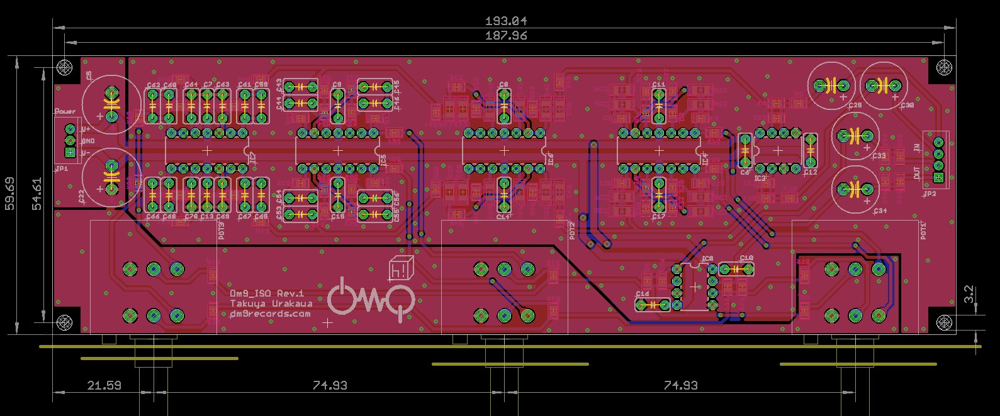
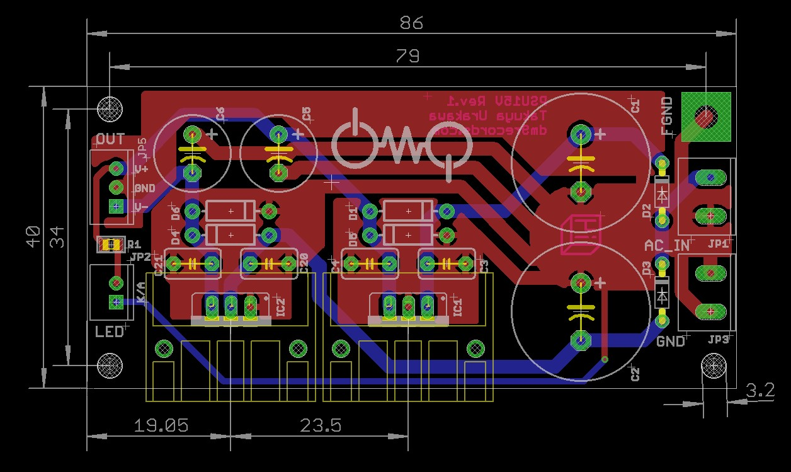
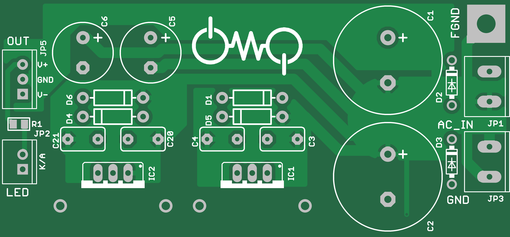
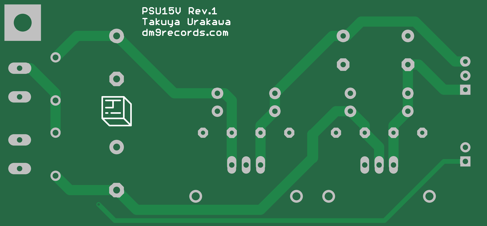
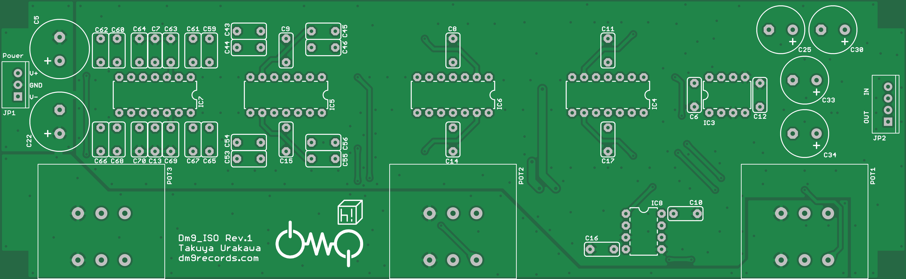
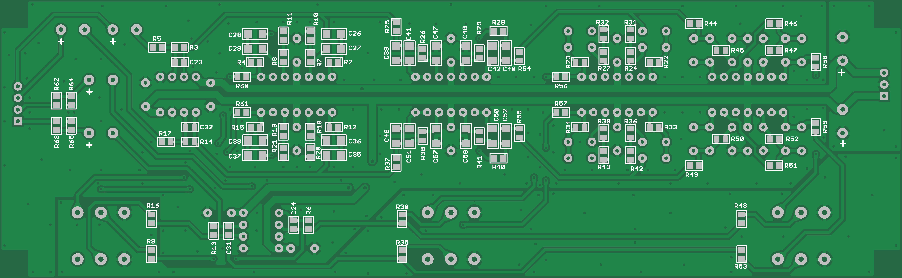
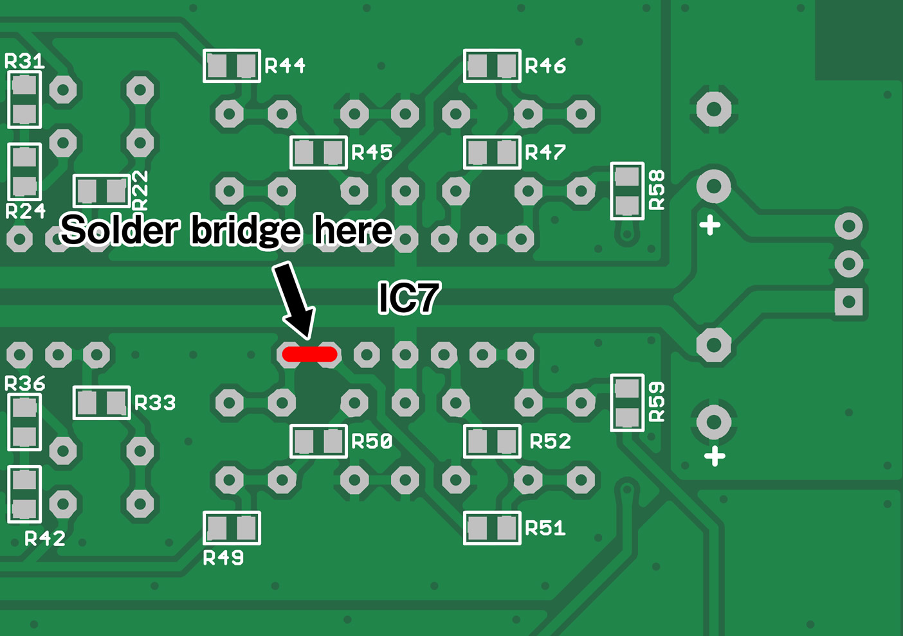

# 3bands Audio Isolator kit for DJs

**Before starting assembly, please read this instruction and check that the parts are complete and arranged.**

## Spec

* 3bands 24db/oct
* Cross over frequency - 250Hz / 250 - 3500Hz / 3500Hz-
* Power internal +-15V 200mA \(need 16VAC-18VAC 500mA input\)

## Parts List

### Power PCB

| RefNo |  | Nums |
| :--- | :--- | :--- |
| C1,2 | Electrolytic capacitor 50V 1000uF | 2 |
| C3,4,20,21 | Multi layer ceramic capacitor 0.1uF | 4 |
| C5,6 | Electrolytic capacitor 25V 47uF | 2 |
| D1,4,5,6 | Diode 1N4007 | 4 |
| D2,3 | Shotcky Diode 1S10 | 2 |
| IC1 | Voltage Regulator 15V 7815 | 1 |
| IC2 | Voltage Regulator -15V 7915 | 1 |
| JP1,3 | Screw Terminal 2pin | 2 |
| R1 | SMD Resisotor 1.5k | 1 |

### Main PCB

| RefNo |  | Nums |
| :--- | :--- | :--- |
| C23,24,31,32 | SMD Multi layer ceramic capacitor 27pF C0G 2% | 4 |
| C25, 30, 33, 34 | Electrolytic capacitor 25V 47uF | 4 |
| C26-29,35,36-42,47-52,57,58 | SMD Film capacitor 3300pF\(3,3nF\) 5% | 20 |
| C43-46,53-56,59-70 | Film capacitor 47nF 5% | 20 |
| C5,22 | Electrolytic capacitor 25V 470uF | 2 |
| C6-17 | Film capacitor 100nF 5% | 12 |
| IC3,8 | Dual opamp TL072 | 2 |
| IC4-7 | Quad opamp TL074 | 4 |
| R2,4,7,8,10-12,15,18-29,31-34,36-47,49-52 | SMD resistor 9.53k 0.5% | 40 |
| R3,5,14,17 | SMD resistor 47k 0.5% | 4 |
| R54-63 | SMD resistor 100R 0.5% | 10 |
| R6, 13 | SMD resistor 100k 0.5% | 2 |
| R9,16,30,35,48,53 | SMD resistor 14k 0.5% | 6 |

### Not included

#### Alps RK27 potentiometers

* Dual
* 10k ohm
* A curve 
* without detent
* need 3 units.

#### PCB connectors

Connector footprints on pcb are suitable for 2.5mm pitch JST XH series. If you can't make xh cable, solder cable directly.

#### Heatsink for voltage regulators

Voltage regulators generate heat.  
So you have to use heatsink and dissipates heat.  
Instead of it, you can use metal enclosure.

#### AC/AC adapter or transformer

Needs AC/AC adapter or transformer. **NOT DC OUTPUT, NEED AC OUTPUT**

* 16VAC - 18VAC
* more than 500mA

like below. [https://www.jameco.com/webapp/wcs/stores/servlet/Product\_10001\_10001\_121216\_-1](https://www.jameco.com/webapp/wcs/stores/servlet/Product_10001_10001_121216_-1)

#### Potentiometer knobs

#### Audio and power connectors

#### LED

For power status.

#### Enclosure

* PCB dimentions
  * main

    

    [pcb\_dimention\_main](https://github.com/hsgw/Docs/tree/304ac43aaf2496af632a4e4e1c4546909639be37/isolator/assets/pcb_dimention_main.jpg)

  * power

    

    [pcb\_dimention\_power](https://github.com/hsgw/Docs/tree/304ac43aaf2496af632a4e4e1c4546909639be37/isolator/assets/pcb_dimention_power.jpg)

## Assembly

### Power PCB

 [pcb\_power\_board\_top.jpg](https://github.com/hsgw/Docs/tree/304ac43aaf2496af632a4e4e1c4546909639be37/isolator/assets/pcb_power_board_top.jpg)

 [pcb\_power\_board\_bottom.jpg](https://github.com/hsgw/Docs/tree/304ac43aaf2496af632a4e4e1c4546909639be37/isolator/assets/pcb_power_board_bottom.jpg)

You should install a fuse\(maybe 1A\) between power input and power unit pcb. And don't forget heatsink of voltage regulators.

### Main PCB

 [pcb\_iso\_board\_top.jpg](https://github.com/hsgw/Docs/tree/304ac43aaf2496af632a4e4e1c4546909639be37/isolator/assets/pcb_iso_board_top.jpg)

 [pcb\_iso\_board\_bottom.jpg](https://github.com/hsgw/Docs/tree/304ac43aaf2496af632a4e4e1c4546909639be37/isolator/assets/pcb_iso_board_bottom.jpg)

#### Need solder bridge!

 [main\_solder\_bridge.jpg](https://github.com/hsgw/Docs/tree/304ac43aaf2496af632a4e4e1c4546909639be37/isolator/assets/main_solder_bridge.jpg)   
Please make solder bridge between pin13 and pin14 at IC7.

